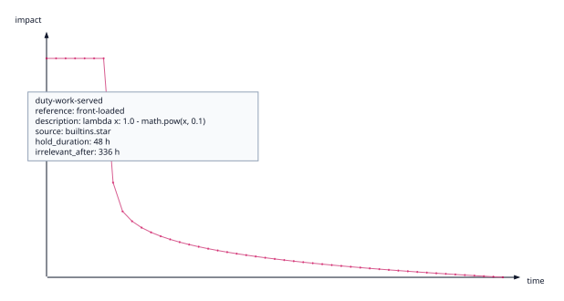
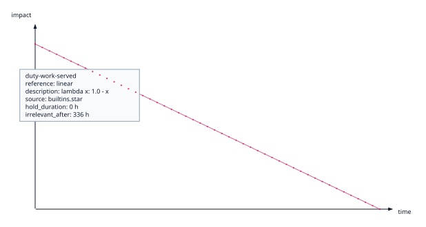
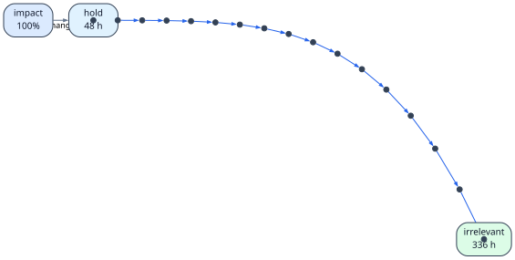

# Roster balance CLI

## Calendar ingestion

For v0, the CLI stays dumb about calendar providers and accepts normalized input through a single adapter layer. The first supported import format should be ICS exports, which lets Outlook and other corporate calendars work without committing to Graph or OAuth integration. Direct Outlook sync can come later only if the operational need justifies the extra scope.
In the future, a Starlark-based ingestion layer could map raw calendar events into roster concepts like availability, absences, or team-specific exceptions while keeping provider connectors in Go.

## Event occurrences and impacts

External inputs are resolved to a stable internal `MemberID` before they enter the domain model. Ingress adapters may start with an email address, calendar identity, or provider-specific user ID, but policies do not resolve identities themselves.

An **event occurrence** is an immutable, binary fact: it happened or it did not. It contains its type, canonical member ID, start time, and elapsed duration. It contains no policy, pay grade, tag, penalty, or impact value.

```text
external input
  -> identity resolution
  -> event occurrence
  -> event type composite
  -> impact math
  -> planner application
```

All time spans use half-open intervals, [`starts_at`, `ends_at`): the lower boundary is inclusive and the upper boundary is exclusive. An occurrence ends at `starts_at + duration`; a zero-duration occurrence is a valid point fact. This avoids fractional-duration workarounds at boundaries.

An **impact math** is a named, reusable lifecycle. It selects an anchor such as `event.ends_at`, a decay profile, and an impact duration. An **event type** is a composite definition that selects one or more impact applications. An occurrence refers only to its event type, so distinct contractual or operational cases may use distinct user-defined event types without exposing personal pay-grade information.

```toml
[impact_maths.call_recovery_24h]
starts_from = "event.ends_at"
decay_profile = "front-loaded"
hold_duration = "24h"
irrelevant_after = "24h"

[[event_types.on_call_call_answered.impacts]]
impact_math = "call_recovery_24h"
application = "roster-lock"
```

For an answered call, the factual call duration and the protection period are independent. Equal `hold_duration` and `irrelevant_after` values define a hard cutoff, so the member cannot be rostered for the 24 elapsed hours following the call's end. At the exclusive end of that interval, the impact is zero and the lock is gone.

Each lifecycle must remain within the system-wide maximum EOL, initially `26280h` (three 365-day years). This is a resource boundary for predictable planner lookback and memory allocation, not a default or a recommended impact duration. Durable audit retention remains independent of that limit.

These concepts remain separate:

* **Team membership**: association and authorization within a team.
* **Roster eligibility**: whether a member may be assigned to a roster.
* **Event occurrence**: a historical fact associated with a member.
* **Impact math**: the bounded time-varying consequence of an occurrence.

Team membership does not imply roster eligibility. Event occurrences and applied impacts target the canonical member identity, never an email address or an unresolved external identity.

## Time semantics and timezone data

Time calculations use explicit semantics:

* **Calendar days** define planning boundaries in an IANA timezone. A planning horizon of seven days means seven local calendar dates, even when a daylight-saving transition creates a 23-hour or 25-hour day.
* **Elapsed durations** define locks, cooldowns, and lifecycle durations. `24h` means exactly 24 elapsed hours.
* **Instants** define event ordering. Recorded event timestamps are stored as instants, preferably in UTC, while retaining the timezone needed to interpret local schedule boundaries.

The policy engine and its Starlark API must expose these concepts with distinct names. Calendar-day arithmetic must use timezone-aware date operations; policies must not assume that one calendar day equals 24 hours.

The selected team's IANA timezone is inherited by the policy context:

```yaml
teams:
  - id: team-a
    timezone: Europe/Berlin
```

Rules do not repeat the timezone for every calculation. The context provides it from the selected team.

The Starlark time API should expose the domain question directly:

```python
day_hours = time.calendar_day_hours(ctx.local_date)

elapsed_hours = time.elapsed_hours(start_instant, end_instant)
```

`calendar_day_hours` measures the length of one local calendar day in `ctx.team.timezone` and may return 23, 24, or 25 around daylight-saving transitions. `elapsed_hours` measures the duration between two instants, so `24h` always means exactly 24 elapsed hours. Policies should not need to inspect raw timezone transition tables.

Timezone transitions are provided by the IANA Time Zone Database. Historical transitions are required for past events, and the current database rules are sufficient for future schedules known today. Future legislation may change those rules, so published schedules must not change silently after a timezone database update.

Generated schedules should record the timezone and tzdata version used to calculate them. A changed timezone database requires an explicit schedule regeneration.

## Bounded impact decay

the impact of a duty-served on later decisions is visually represented by math plotting. Example:

```text
https://www.desmos.com/calculator/ozfmmd1ztm
```

The CLI emits structured JSON for downstream consumers; rendering and transformation remain outside the binary.

## Team-Owned Policies

For v0, Team-owned policies are git-managed.

## Configuration schema status

The configuration schema is work in progress. It currently covers the initial CLI configuration slice only; the factor lifecycle model and stricter ingress validation will be specified and implemented incrementally.

## JSON factor inspection

Inspect the current factor defaults as canonical JSON:

```text
rosterbalance inspect factors
```

The output includes a versioned schema identifier, lifecycle durations in hours, and resolved curve samples. It is intended for downstream transformation, such as a separate `gomplate` step, rather than for terminal rendering.

Render the lifecycle metadata as Graphviz DOT with the shipped template:

```sh
rosterbalance inspect factors \
  | gomplate -d config='stdin:///dev/stdin?type=application/json' \
      -f templates/factor-curve.dot.tmpl \
  | neato -n2 -Tsvg > factor-curve.svg
```

Generate diagrams for all built-in decay profiles with Mise:

```sh
mise run factor-curves
```

The generated SVGs are written to `docs/factor-curves/`.

### Previewing your own factor configuration

To preview curves for your own config on your own machine, install [Graphviz](https://graphviz.org/download/) and [gomplate](https://docs.gomplate.ca/installing/), then either use the shipped Mise task against your config:

```sh
rosterbalance inspect factors --config path/to/your-config.toml \
  | gomplate -d config='stdin:///dev/stdin?type=application/json' \
      -f templates/factor-curve.dot.tmpl \
  | neato -n2 -Tsvg > preview.svg
```

or adapt the `factor-curves-dot`/`factor-curves` tasks in `mise.toml` to point at your own config files. No data leaves your machine; the whole pipeline runs locally.

## Math and Config

The `duty-work-served` weight uses a bounded decay profile. Each factor owns its lifecycle: the lifecycle holds the initial impact for an optional period, transitions according to its decay profile, and makes the factor irrelevant after a defined boundary.

## The core issue

| Curve       | Formula             | Hits zero?        |
| ----------- | ------------------- | ----------------- |
| Exponential | a·e^(−λt)           | No (asymptotic)   |
| Linear      | a·(1 − t/T)         | Yes, exactly at T |
| Power-law   | a·(1 − t/T)ⁿ        | Yes, exactly at T |
| Cosine      | a·(1 + cos(πt/T))/2 | Yes, exactly at T |

The first version keeps this deliberately small. The calculation is an implementation detail; user config refers to the semantic distribution of impact over the factor lifecycle.

## Factor curves

A factor curve models how a historical factor's impact diminishes over time across three lifecycle parameters:

* `hold_duration`: keeps the initial impact unchanged ($1.0$) for at least that long.
* `decay_profile`: controls the transition curve shape between `hold_duration` and end of life.
* `irrelevant_after` (EOL): the end-of-life boundary where the factor's impact reaches zero and no longer affects planning decisions.

```text
0 -------- hold_duration ---------------- irrelevant_after (EOL)
|          |                              |
initial    decay profile                  zero impact
impact     transition                     and irrelevant
```

### User-facing configuration

```yaml
factors:
    - name: duty-work-served
      lifecycle:
        decay_profile: front-loaded
        hold_duration: 2d
        irrelevant_after: 14d
```

**Reading it in plain English:** *"Previous duty work keeps its initial impact for two days, then fades in a front-loaded way and is irrelevant after fourteen days."*

### Built-in decay profiles

Each profile below can be generated locally with `mise run factor-curves` from its example configuration in [examples/factor-profiles/](examples/factor-profiles/).

#### `front-loaded`

Concentrate the decay near the beginning of the transition after `hold_duration`.



#### `linear`

Decrease the impact uniformly through the transition from `hold_duration` to `irrelevant_after`.



#### `back-loaded`

Preserve most of the impact until later in the transition, dropping steeply near `irrelevant_after`.



### Lifecycle validation

Lifecycle validation ensures:

* Durations are non-negative.
* `irrelevant_after` (EOL) cannot be lower than `hold_duration`; equal values produce a hard cutoff.
* Impact stays between $0$ and $1$.
* Impact does not increase after the hold period.
* Impact is zero at `irrelevant_after`.

## Why the power curve is the sweet spot

* **Linear** (n=1) feels too abrupt — weight drops fast early, then stalls near zero.
* **Cosine** is smooth but hard to explain to non-math people.
* **Power-law** (n=2) gives a natural "fast at first, then tail" feel that matches intuition about memory, and the exponent is a single intuitive knob:
  * n=1 → linear
  * n=2 → "quadratic fade" (most common default)
  * n=3 → steeper initial drop

The first version may use a bounded power curve internally for the smooth profiles, while keeping the user-facing config to the five semantic profile names above. Exponents and other calculation parameters are not user-configurable.
